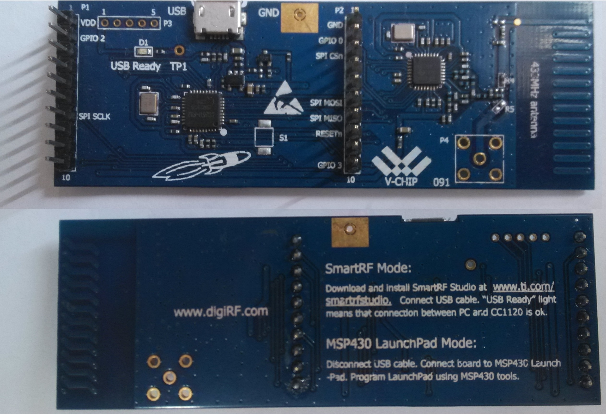
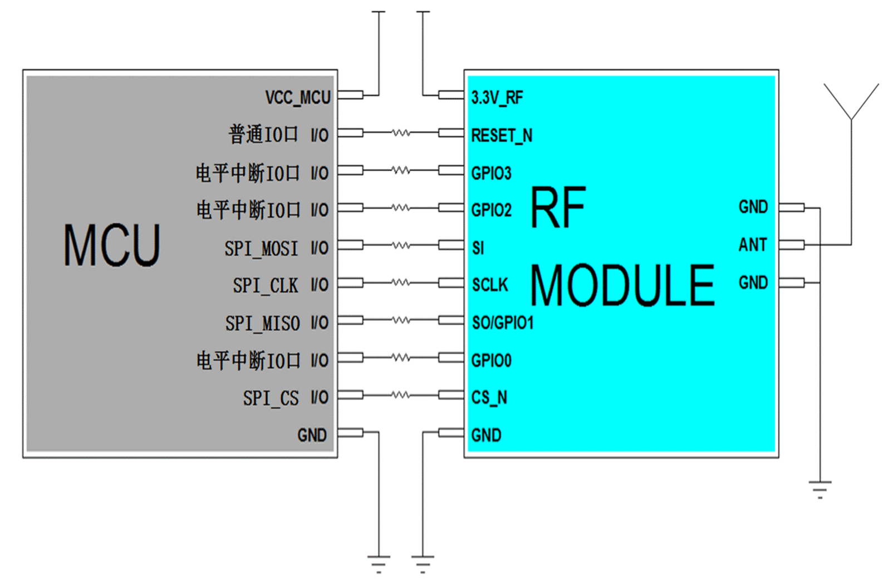
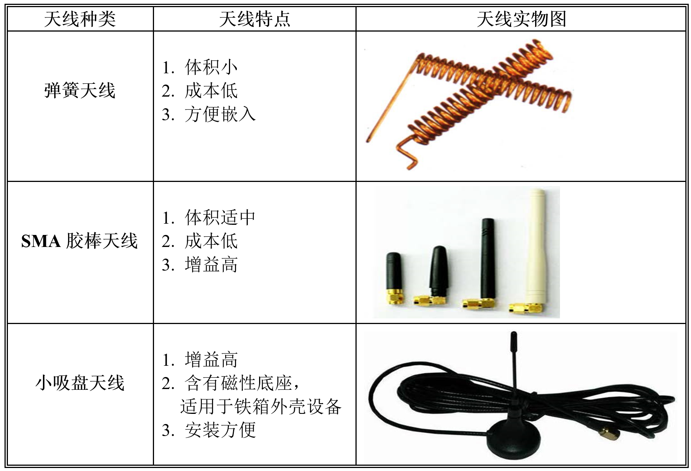
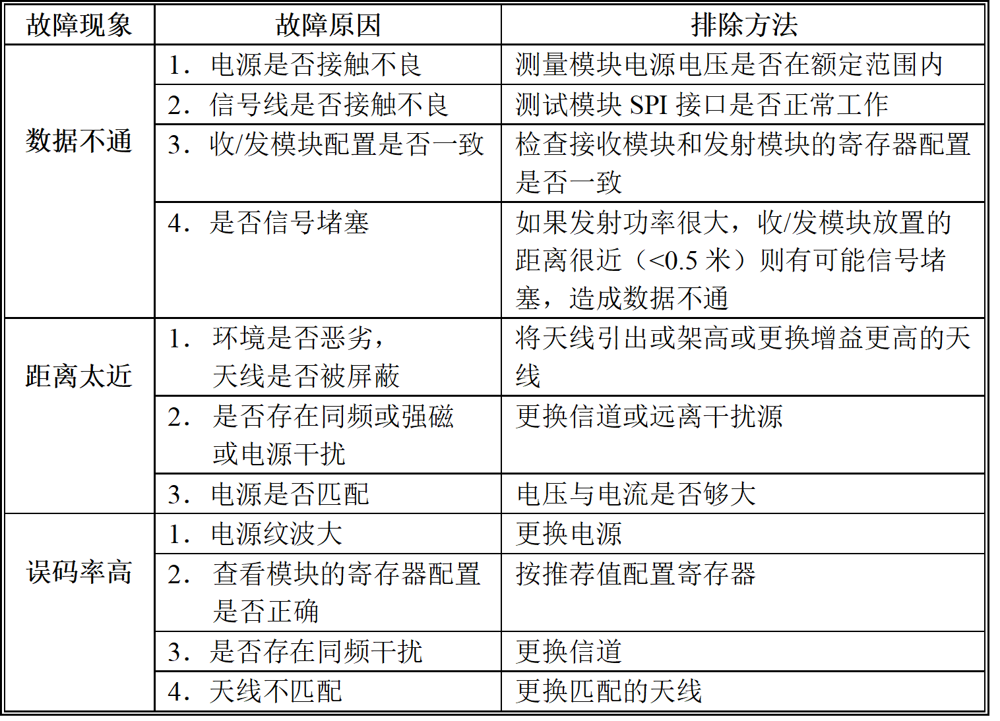

# CC1120 Sub-1G 无线射频收发器使用手册


# CC1120 无线射频收发器简介

CC1120 无线射频收发器是 TI Chipcon 推出的 ISM 频段无线收发芯片之一， 主要设定为 170 / 433 / 868 / 915 / 950MHz 频段，最大输出功率可达 +15dBm，最高传输速率达 200Kbps。模块集成了所有射 频相关功能，用户不需要对射频电路设计深入了解，就可以使用本模块轻易地开发出性能稳定、可靠性高的无线产品。




## 基本特点

- 433MHz 无线收发器，可定制 170M / 868M / 915M / 950M 等其它载频
- 支持 2-FSK, 2-GFSK, 4-FSK, 4-GFSK, MSK, OOK/ASK 调制
- -11 ~ 15 dBm 功率输出可配制
- 在 1.2kbps 速率时接收灵敏度可达 -123dBm
- 可编程配置传输数率 1.2~ 200 kbps
- 低功耗 2.0~3.6V 供电
- 点对点，点对多点，灵活通信方式
- RSSI 输出和载波侦听指示
- 独立 128 字节 RX 和 TX FIFO
- 高稳定性，可靠性达到工业级别


## 应用范围

- 工业仪器仪表无线数据采集和控制
- 无线计量和无线智能电网
- 物流跟踪、仓库巡检、电子标签等
- 工业仪器仪表无线数据采集和控制
- 住宅与建筑物（智能家居）控制
- 电子消费类产品无线遥控
- 无线报警与安全系统
- 无线传感器网络


## 技术参数

测试条件：Ta=25°C，Vcc=3.3V

| **技术指标** | **参数**                                     | **备注**   |
| ------------ | -------------------------------------------- | ---------- |
| 频率范围     | 410 ~ 480MHz (默认初始化为：434 MHz)         | 可编程配置 |
| 调制方式     | 2-FSK / 4-FSK / 2-GFSK / 4- GFSK / MSK / OOK | 可编程配置 |
| 传输速率     | 0～200 kbps                                  | 可编程配置 |
| 发射功率     | -11～15 dBm                                  | 可编程配置 |
| 数据速率     | 0～200 kbps                                  |            |
| 休眠电流     | ≤ 1 uA                                       |            |
| 发射电流     | ≤ 50 mA                                      |            |
| 接收电流     | ≤ 22 mA                                      |            |
| 频率误差     | +/-10 ppm                                    |            |
| 接收灵敏度   | -118 dBm (1.2 kbps)                          | 与速率有关 |
| 天线阻抗     | 50 ohm                                       |            |
| 供电电压     | 2.0～3.6 V                                   |            |
| 工作温度     | -20°C～75°C                                  |            |
| 存储温度     | -40°C～125°C                                 |            |

备注：

1． 模块的通信速率会影响通信距离和接收灵敏度，速率越高，通信距离越近。

2． 模块的供电电压会影响发射功率，在工作电压范围内，电压越低，发射功率越小。

3． 模块的工作温度变化时，中心频率会改变，只要不超出工作温度范围，不影响应用。

4． 天线对通信距离有很大的影响，请选用匹配的天线并正确安装。

5． 模块的安装方式会影响通信距离。


# CC1120 硬件相关设计


## CC1120 硬件接口电路 (引脚定义) 

通信接口：采用 4 线 SPI 串行接口。用于配置数据和缓冲区的存取。

| **引脚** | **类型**      | **描述**                               |
| -------- | ------------- | -------------------------------------- |
| VCC      | 工作电源      | 直流2.0-3.6V输入                       |
| GND      | 地            |                                        |
| CS_N     | 数字输入      | 模块选择（SPI）低电平有效              |
| SCLK     | 数字输入      | 时钟输入（SPI）                        |
| SI       | 数字输入      | 数据输入（SPI）                        |
| SO/GPIO1 | 数字输入/输出 | 数据输出（SPI）或通用数字输入/输出接口 |
| GDIO0    | 数字输入/输出 | 数据输出，由寄存器配置                 |
| GDIO2    | 数字输入/输出 | 数据输入/输出，由寄存器配置            |
| GDIO3    | 数字输入/输出 | 数据输入/输出，由寄存器配置            |
| RESET_N  | 数字输入      | 复位低电平有效                         |
| ANT      | 天线端口      | 阻抗50ohm                              |



注意：

GDIO3、GDIO2、GDIO0，这三个引脚，要接到 MCU 的“具有中断功能的中断 IO 引脚”（因为 GDIOx 引脚可作为指示接收或发送完成的中断引脚，向控制器 MCU 提供一个下降沿）


## CC1120 常用外置天线




# CC1120 软件相关设计

## CC1120 初始化默认参数配置（常用）

CC1120 寄存器配置值可用 SmartRF Studio 工具产生，各寄存器的意义请参阅 CC1120 芯片规格书。

驱动功能与 TI 的 SmartRF Studio 7 套件的功能相同，可直接连接 SmartRF Studio 以控制 CC1120，也可以用提供例程演示 CC1120 模块的通信效果。

|      | **参数**       | **功能描述**                        | **备注**   |
| ---- | -------------- | ----------------------------------- | ---------- |
| 1    | 频段选择       | 410.0 - 480.0 MHz频段               | 可编程配置 |
| 2    | 载波频率       | 434.000000   MHz                    | 可编程配置 |
| 3    | 数据速率       | 1.2 kbps                            | 可编程配置 |
| 4    | 发射功率       | 15 dBm                              | 可编程配置 |
| 5    | 调制格式       | 2-FSK                               | 可编程配置 |
| 6    | 频率偏差       | 3.997803 KHz                        |            |
| 7    | 接收滤波器带宽 | 25.00 KHz                           |            |
| 8    | 数据包长度模式 | 可变数据包长度模式                  |            |
| 9    | 数据包长度     | 255 个字节                          |            |
| 10   | 地址检查使能   | 禁用                                |            |
| 11   | 设备地址       | 默认为0（8位）                      |            |
| 12   | GPIO3 引脚     | 配置为数据包发送/接收成功的指示引脚 |            |

## CC1120 驱动程序 API 说明

| API 名称                                                     | 功能描述                                                     | **备注**                                                     |
| ------------------------------------------------------------ | ------------------------------------------------------------ | ------------------------------------------------------------ |
| void Initial_CC112x(void)                                    | 初始化设置:   "CC112x 无线射频收发器"                        |                                                              |
| void Osccon_Initial(void)                                    | 晶振初始化函数: 配置相关晶振参数                             |                                                              |
| void Timer2_Initial(void)                                    | 定时器 A2 初始化设置，用于系统每 1 ms 自动中断一次。         |                                                              |
| static void Initial_SPI_CC112x(void)                         | 初始化: SPI 串行接口 ( CC112x )                              |                                                              |
| Static void  Initial_GPIO_Int_CC112x(void)                   | 初始化: GPIO 电平中断                                        |                                                              |
| static void registerConfig(void)                             | 初始化 CC112x 的配置寄存器                                   |                                                              |
| static void manualCalibration(void)                          | 根据勘误表校准 CC112x                                        |                                                              |
| trxSpiCmdStrobe(CC112X_SRX)                                  | 初始配置 CC112x 处于接收状态                                 |                                                              |
| void Deal_RX_CC112x(void)                                    | 处理接收部分 "CC112x无线射频收发器"                          |                                                              |
| void TX_String_CC112x (unsigned char *pData,  unsigned char len) | CC112x 发送数据                                              | 注意：len <= 128                                             |
| #define  CC112X_820_band    (1)                              | // 820.0 - 960.0 MHz band                                    |                                                              |
| #define  CC112X_410_band    (2)                              | // 410.0 - 480.0 MHz band                                    |                                                              |
| #define  CC112X_273_3_band  (3)                              | // 273.3 - 320.0 MHz band                                    |                                                              |
| #define  CC112X_205_band    (4)                              | // 205.0 - 240.0 MHz band                                    |                                                              |
| #define  CC112X_164_band    (5)                              | // 164.0 - 192.0 MHz band                                    |                                                              |
| #define  CC112X_136_7_band  (6)                              | // 136.7 - 160.0 MHz band                                    |                                                              |
| void Config_FrequencyBand (unsigned char bandKind)           | 设置芯片工作频率：  步骤01：选择—“频段”  步骤02：配置—“具体工作频率”<br />此 API 为 “步骤01” ：配置:频段--"CC112x 无线射频收发器" | 注意：1<= bandKind <=6 默认配置为 410.0 ~ 480.0 MHz 频段     |
| void  Config_CarrierFrequency  (unsigned char  frenquency_2,  unsigned char frenquency_1,  unsigned char  frenquency_0) | 此 API 为“步骤02”  配置—“具体工作频率”   <br />配置:载波频率 "CC112x 无线射频收发器 | 载波频率的计算公式，请参阅 CC112x User's Guide               |
| void Config_RxFilterBW  (unsigned char rxFilterBW)           | 配置:接收滤波器带宽 "CC112x 低功耗无线射频收发器<br />对于 CC1120，接收滤波器带宽25kbps  对应的寄存器值  CC112X_CHAN_BW=0x08 | 接收滤波器带宽的计算公式，请参阅 CC112x User's Guide<br />注意：Bite rate(DataRate) < RX filter BW /2 |
| void Config_DataRate (unsigned char dataRate_2,unsigned char dataRate_1,unsigned char dataRate_0) | 配置:数据速率 "CC112x 低功耗无线射频收发器"                  | 数据速率的计算公式，请参阅CC112x User's Guide<br />注意：Bite rate(DataRate) < RX filter BW /2 |
| void Config_ModulationFormat_Deviation<br/>(unsigned char modulation,<br/>unsigned char deviation) | 配置:调制格式和频率偏差 "CC112x 无线射频收发器"<br />默认MOD_FORMAT 调制格式=000= "2-FSK", 频率偏差= 3.99780 kHz | 频率偏差的计算公式，请参阅 CC112x User's Guide               |
| void Config_PA_TxPower (unsigned char txPower)               | 配置:发射功率(功率放大器) "CC112x 无线射频收发器"            | 默认发射功率 = 15 dBm  (最大功率)                            |
| void Config_DeviceAddress(unsigned char deviceAddress)       | 配置:设备地址 " CC112x 低功耗无线射频收发器"                 | 1) 默认设备地址Device Address = 0 <br/>2) 设备地址为1个字节<br/>3) 在接收数据包过滤时使用的地址<br/>4) 根据CC112X_PKT_CFG1,.ADDR_CHECK_CFG位段的值，决定是否“使能地址检查” |
|                                                              |                                                              |                                                              |

具体有不清楚的地方，请查阅模块的源码(有详细注解)。


## CC1120 无线模块驱动源码（开源）

- https://gitee.com/createshare/AIoT__Wirless-Module/tree/master/CC1120_Wireless_Module_Sub-1G/code/CC112x_Driver
- https://github.com/createshare/AIoT__Wirless-Module/tree/master/CC1120_Wireless_Module_Sub-1G/code/CC112x_Driver


# 附录 1：常见故障及排除方法



# 附录 2：CC1120 存器的初始化及详细注释

```c
static const registerSetting_t preferredSettings[]= 
{  
//IOCFG3 -GPIO3引脚配置//复位值=0x06 (复位时选"PKT_SYNC_RXTX" )
	//GPIO3_ATRAN 模拟传输使能= 0=选择标准数字GPIO
	//GPIO3_INV 反转输出使能= 0=禁止输出反转
	//GPIO3_CFG 输出选择= 000110=选"PKT_SYNC_RXTX" =CC1120发送/接收到同步字时置位，并在数据包的末尾取消置位。
	{CC112X_IOCFG3,            0x06}, 

//IOCFG2 -GPIO2引脚配置//复位值=0x07(复位时选"PKT_CRC_OK" )
	//GPIO2_ATRAN 模拟传输使能= 1=禁用数字GPIO
	//GPIO2_INV 反转输出使能= 0=禁止输出反转
	//GPIO2_CFG 输出选择= 110000=选"HIGHZ" =  高阻抗（三态）
	{CC112X_IOCFG2,            0xB0},
	
//IOCFG1 -GPIO1引脚配置//复位值=0x30(复位时选"HIGHZ"=  高阻抗 )
//注意：GPIO1与SPI的MISO引脚复用。当CSn有效（低电平），GPIO1作为MISO输出引脚。
//注意：系统必须通过软件或硬件确保 MISO引脚上拉。
	//GPIO1_ATRAN 模拟传输使能= 1=禁用数字GPIO
	//GPIO1_INV 反转输出使能= 0=禁止输出反转
	//GPIO1_CFG 输出选择= 110000=选"HIGHZ" =  高阻抗（三态）
	{CC112X_IOCFG1,            0xB0},

//IOCFG0 -GPIO0引脚配置//复位值=0x3C(复位时选"EXT_OSC_EN"=  使能外部振荡器 )
	//GPIO0_ATRAN 模拟传输使能= 1=禁用数字GPIO
	//GPIO0_INV 反转输出使能= 0=禁止输出反转
	//GPIO0_CFG 输出选择= 110000=选"HIGHZ" =  高阻抗（三态）
	{CC112X_IOCFG0,            0xB0},

//SYNC0 ~ SYNC3-32位同步字
	{CC112X_SYNC3,             0xD3},//SYNC3 //复位值=0x93
	{CC112X_SYNC2,             0x91},//SYNC2 //复位值=0x0B
	{CC112X_SYNC1,             0xD3},//SYNC1 //复位值=0x51
	{CC112X_SYNC0,             0x91},//SYNC0 //复位值=0xDE
	
//SYNC_CFG1-同步字检测配置//复位值=0x0A
	//DEM_CFG 前导质量阈值使能位 =000=禁用前导质量阈值 (PQT),
	//SYNC_THR 软件设置的同步字阈值=0x0B。
	{CC112X_SYNC_CFG1,         0x0B},
	
//care--未初始化//SYNC_CFG0 - 同步字长度配置//复位值=0x17H
	//SYNC_MODE 同步字长度配置=101=选择32同步字//32 bits
	//SYNC_NUM_ERROR 位同步字检查=11=禁用误码限定符。无校验位错误  //Bit Error Qualifier disabled. No check on bit errors

//care--未初始化//DEVIATION_M -频率偏差配置//复位值=0x06
	//频率偏差（尾数的一部分）DEV_M  = 0x06

//care--未初始化//MODCFG_DEV_E-调制格式和频率偏差配置//复位值=0x03
	//MODEM_MODE 调制解调器模式配置= 00 =普通模式
	//MOD_FORMAT 调制格式=000= "2-FSK"    //001=2-GFSK //010=Reserved //011=ASK/OOK //100=4-FSK //101=4-GFSK //110=SC-MSK unshaped (CC1125, TX only). For CC1120, CC1121, and CC1175this setting is reserved  //111=SC-MSK shaped (CC1125, TX only). For CC1120, CC1121, and CC1175 thissetting is reserved
	//DEV_E  频率偏差（指数部分）= 011
		//★频率偏差 Deviation = 3.997803

//DCFILT_CFG-数字直流去除配置//复位值=0x4C
	//DCFILT_FREEZE_COEFF 直流滤波器覆盖=0 =直流滤波算法估计和补偿直流误差
	//DCFILT_BW_SETTLE AGC调整后的稳定期=011=256 samples
	//DCFILT_BW 直流滤波器带宽= 100;
	{CC112X_DCFILT_CFG,        0x1C},
									
//PREAMBLE_CFG1-前导码长度配置//复位值=00010100
	//NUM_PREAMBLE 设置要被发送的前导位的最小数目= 0110 = 4字节
	//PREAMBLE_WORD 前导码字节配置= 00 = 选择10101010 (0xAA)
	{CC112X_PREAMBLE_CFG1,     0x18},

//care--未初始化//PREAMBLE_CFG0-前导码长度配置//复位值=00101010
	//PQT_EN 前导码检测使能位 = 1=使能前导码检测
	//PQT_VALID_TIMEOUT PQT启动定时器  = 0=16个码元
	//PQT  软件设置PQT   (前导质量阈值)= 0x0A  

//care--未初始化//FREQ_IF_CFG-RX混频器频率配置//复位值=0x40
	//FREQ_IF 数字接收机混频器频率=0x40

//IQIC-数字图像信道补偿配置//复位值=11000100
	//IQIC_EN  IQ图像补偿使能位=1=启用图像补偿
	//IQIC_UPDATE_COEFF_EN  IQIC更新系数使能 = 1=使能IQIC系数更新（更新IQIE_I1 IQIE_I0，IQIE_Q1，IQIE_Q0寄存器）
	//IQIC_BLEN_SETTLE  稳定时，IQIC块长度值=00=8个样本
	//IQIC_BLEN  IQIC块长度值=01=32个样本
	//IQIC_IMGCH_LEVEL_THR   IQIC图像信道电平阈值=10=选择“>1024”
	{CC112X_IQIC,              0xC6},

//CHAN_BW-信道滤波器配置//复位值=0x14
	//CHFILT_BYPASS  信道滤波器旁路 =0=使能信道滤波器（不旁路）
	//ADC_CIC_DECFACT  第一个抽取因子选择位=0=抽取因子为20
	//BB_CIC_DECFACT  第二个抽取因子选择位= 001000=最小RX滤波器带宽BW为8KHz
		//★"RX filter BW = 25KHz"
	{CC112X_CHAN_BW,           0x08},  

//care--未初始化//MDMCFG1-通用调制解调器参数配置//复位值=01000110
	//CARRIER_SENSE_GATE  同步字搜索配置= 0=同步字搜索，无论CS为什么状态
	//FIFO_EN  FIFO使能 =1=数据输入/输出通过FIFO
	//MANCHESTER_EN  曼彻斯特使能= 0=NRZ（不使能）
	//INVERT_DATA_EN  数据反转使能=0=禁止数据反转
	//COLLISION_DETECT_EN  冲突检测使能=0=禁用冲突检测
	//DVGA_GAIN  固定DVGA增益配置=11=9 dB DVGA
	//SINGLE_ADC_EN  配置活动的接收信道的数量=0=IQ-信道
		//★禁用曼彻斯特
	
//MDMCFG0-通用调制解调器参数配置//复位值=00001101
	//TRANSPARENT_MODE_EN  透明模式使能=0=禁用透明模式使能
	//TRANSPARENT_INTFACT  透明信号插值因子=00=1*透明信号插值输出前一次（复位）//00    1x transparent signal interpolated one time before output (reset)
	//DATA_FILTER_EN  透明的数据过滤和扩展数据过滤使能=0=禁止透明数据过滤和禁用扩展的数据过滤器
	//VITERBI_EN 维特比检测使能=1=使能使能=1=使能
	//MDMCFG0_RESERVED1_0  =01=仅用于测试目的，使用值从"SmartRF"套件
	{CC112X_MDMCFG0,           0x05},

//care--未初始化//DRATE2-数据速率配置指数和尾数//复位值=0x43
	//DATARATE_E  数据速率（指数部分）=0100=0x04
	//DATARATE_M_19_16  数据率（尾数部分[19-16位]）=0011

//care--未初始化//DRATE1-数据速率配置尾数[15:8]//复位值=0xA9
	//DATARATE_M_15_8  数据速率配置尾数[15:8] = 0xA9

//care--未初始化//DRATE0-数据速率配置尾数[7:0]//复位值=0x2A
	//DATARATE_M_7_0   数据速率配置尾数[7:0]  =0x2A
		//★数据速率=1.2 kbps

//AGC_REF-AGC参考电平配置//复位值=0x36
	//AGC_REFERENCE  AGC参考电平= 0x20      //AGC: 自动增益控制
	{CC112X_AGC_REF,           0x20},

//AGC_CS_THR-载波检测阈值配置//复位值=0x00
	//AGC_CS_THRESHOLD   AGC载波检测阈值= 0x19    //AGC: 自动增益控制
	{CC112X_AGC_CS_THR,        0x19},

//care--未初始化//AGC_GAIN_ADJUST-RSSI偏移配置//复位值=0x00
	//GAIN_ADJUSTMENT  AGC增益调整= 0x00     //AGC: 自动增益控制

//care--未初始化//AGC_CFG3-AGC配置//复位值=10010001
	//RSSI_STEP_THR = 1=RSSI阈值是6 dB (RSSI :接收信号强度指示)
	//AGC_ASK_BW  =00=无数据过滤器
	//AGC_MIN_GAIN  AGC最小增益=0x11
	
//care--未初始化//AGC_CFG2-AGC配置//复位值=00100000
	//START_PREVIOUS_GAIN_EN  = 0 =以最大增益值开始接收
	//FE_PERFORMANCE_MODE  选择应用的增益表=01=正常操作模式
	//AGC_MAX_GAIN   AGC  最大增益 = 00000

//AGC_CFG1-AGC配置//复位值=10101010=0xAA
	//AGC_SYNC_BEHAVIOR  AGC同步字检测后的操作 = 101=同时冻结AGC增益和RSSI
	//AGC_WIN_SIZE  AGC积分窗口中的每一个值的大小 = 010=32个样本
	//AGC_SETTLE_WAIT  设置AGC增益调整之间的等待时间 = 01=32个样本
	{CC112X_AGC_CFG1,          0xA9},

//AGC_CFG0-AGC配置//复位值=11000011=0xC3
	//AGC_HYST_LEVEL  AGC迟滞等级 = 11=10 dB
	//AGC_SLEWRATE_LIMIT  AGC斜率限制= 00= 60 dB
	//RSSI_VALID_CNT  输入到平均滤波器的样本数= 11=9
	//AGC_ASK_DECAY  在ASK/ OOK模式,控制衰减步骤 = 11=1/128 IIR衰减
	{CC112X_AGC_CFG0,          0xCF},

//FIFO_CFG-FIFO配置//复位值=0x80
	//CRC_AUTOFLUSH  = 0= 如果一个CRC错误发生，自动刷新RX FIFO中最后收到的数据包。如果该位被关闭，应再次打开，必须先发一个SFRX选通信号
	//FIFO_THR  RX和TX FIFO的阈值 = 0x00=达到阈值时，FIFO_THR= 0表示TX FIFO中有127字节，RX FIFO中有1个字节；而FIFO_THR= 127 表示TX FIFO中有0字节，RX FIFO有128字节。
	{CC112X_FIFO_CFG,          0x00},

//care--未初始化//DEV_ADDR-设备地址配置//复位值=0x00
	//DEVICE_ADDR  设备地址=0x00=在接收数据包过滤时使用的地址
		//★设备地址=0x00

//SETTLING_CFG-//复位值=00001011
	//FS_AUTOCAL   自动进行校准=00= 从不（手动校准使用SCAL选通信号）
	//LOCK_TIME  设置的频率合成器，以解决锁定状态的时间= 01=  75/30 μs
	//FSREG_TIME 频率合成器的稳定时间（使用值来自SmartRF套件）= 1 = 60 μs
	{CC112X_SETTLING_CFG,      0x03},

//FS_CFG-频率合成器的配置//复位值=0x02
	//FS_LOCK_EN  输出锁定检测使能= 0 = 禁用输出锁定检测
	//FSD_BANDSELECT  频段选择设置LO分频器 = 0100 = 410.0 - 480.0 MHz频段（LO分频器= 8）//0010=820.0 - 960.0 MHz band //100=410.0 - 480.0 MHz band //0110=273.3 - 320.0 MHz band //1000=205.0 - 240.0 MHz band //1010=164.0 - 192.0 MHz band //1011=136.7 - 160.0 MHz band 
		//★频段选择= 410.0 - 480.0 MHz频段（LO分频器= 8） //Frequency Synthesizer Configuration
	{CC112X_FS_CFG,            0x04},
		

//care--未初始化//WOR_CFG1-eWOR配置//复位值=00001000
	//WOR_RES    eWOR定时器分辨率= 00 =高分辨率
	//WOR_MODE   eWOR 模式= 001 = 正常模式
	//EVENT1   事件1超时 = 000 =4

//care--未初始化//WOR_CFG0-eWOR配置//复位值=00100001
	//DIV_256HZ_EN   时钟分频使能(在睡眠模式下启用时钟分频) = 1 = 启用时钟分频
	//EVENT2_CFG      事件2超时 = 00 =禁用
	//RC_MODE  RCOSC校准模式 = 00 = 禁用RCOSC校准
	//RC_PD   RCOSC掉电信号位 = 1 =RCOSC是在掉电状态

//care--未初始化//WOR_EVENT0_MSB-事件0配置//复位值=0x00
	//EVENT0_15_8   事件0超时（MSB）= 0x00

//care--未初始化//WOR_EVENT0_LSB-事件0配置//复位值=0x00
	//EVENT0_7_0    事件0超时（LSB）= 0x00

//PKT_CFG2-包配置//复位值=00000100
	//PKT_CFG2_RESERVED5  = 0  //仅用于测试目的，使用值来自SmartRF套件
	//CCA_MODE   CCA模式= 000 = 总是给一个明确的信道指示
	//PKT_FORMAT  数据包格式配置 = 00=正常模式/ FIFO模式（MDMCFG1.FIFO_EN必须设置为1和MDMCFG0.TRANSPARENT_MODE_EN必须设置为0）
	{CC112X_PKT_CFG2,          0x00},

//care--未初始化//PKT_CFG1-包配置//复位值=00000101
	//WHITE_DATA   白化使能 = 0 =禁用数据白化
	//ADDR_CHECK_CFG    地址检查配置 = 00=无地址检查
	//CRC_CFG   CRC配置 = 01 = TX模式时，计算CRC；在RX模式，检查CRC
	//BYTE_SWAP_EN   TX/ RX数据字节交换使能= 0 = 禁用：字节的数据交换
	//APPEND_STATUS   附加状态字节到RX FIFO使能= 1 =附加状态字节
		//★禁用数据白化     
		//★无地址检查     
		//★CRC配置 = 01 = TX模式时，计算CRC；在RX模式，检查CRC

//PKT_CFG0-包配置//复位值=0x00
	//PKT_CFG0_RESERVED7  = 0 //仅用于测试目的，使用值来自SmartRF套件
	//LENGTH_CONFIG  数据包长度配置= 01=可变数据包长度模式。同步字后收到的第一个字节为数据包长度配置 //00固定数据包长度模式。数据包长度通过PKT_LEN寄存器配置
	//PKT_BIT_LEN = 000  //用在固定数据包长度模式：PKT_BIT_LEN（不为零）表示数位发送/接收的PKT_LEN的字节数。
	//UART_MODE_EN  UART模式使能= 0=禁用UART模式  //1=使能UART模式。当启用时，数据包引擎将插入/删除开始和停止位/发送/接收的字节
	//UART_SWAP_EN   启动和停止位值互换使能 = 0=禁用交换。启动/停止位值是'1'/'0'
		//★可变数据包长度模式。同步字后收到的第一个字节为数据包长度配置 
	{CC112X_PKT_CFG0,          0x20}, 

//care--未初始化//RFEND_CFG1 -RFEND配置//复位值=00001111
	//RXOFF_MODE  RXOFF模式= 00=空闲  //01= FSTXON //10=TX //11=RX  //在芯片接收到良好的数据包后，决定CC1120将进入什么状态。
	//RX_TIME  RX在RX同步字搜索超时配置= 111
	//RX_TIME_QUAL  RX超时限定符= 1= 如果没搜索到同步字，或达到PQT，或CS有效时，在RX超时，继续工作在RX模式

//care--未初始化//RFEND_CFG0 -RFEND配置//复位值=0x00
	//CAL_END_WAKE_UP_EN  校准结束附加的唤醒脉冲使能 = 0 =禁止附加的唤醒脉冲
	//TXOFF_MODE   TXOFF模式 =00=空闲  //01=FSTXON //10=TX //11=RX
	//TERM_ON_BAD_PACKET_EN	终止错误的数据包使能 =0=禁用终止坏包。当一个错误的数据包被接收（地址，长度或CRC有错误）时，无线芯片进入状态由RFEND_CFG1.RXOFF_MODE确定
	//ANT_DIV_RX_TERM_CFG   直接RX终止和天线分集配置= 000=禁用：由CS/ PQT决定的天线分集和终止功能

//care--未初始化//PA_CFG2 -功率放大器配置//复位值=01111111
	//PA_CFG2_RESERVED6  = 1  //仅用于测试目的，使用值来自SmartRF套件
	//PA_POWER_RAMP   PA功率斜坡目标水平=111111  //此时输出功率=（PA_POWER_RAMP+1）/2  -18 = 14   //0x7F=发射功率15dBm //0x7D=14dBm //0x7B=13dBm //0x79=12dBm  //0x77=11dBm //0x74=10dBm  //0x72=9dBm //0x6F=8dBm   //0x6D=7dBm //0x6B=6dBm   //0x69=5dBm //0x66=4dBm   //0x64=3dBm //0x62=2dBm   //0x5F=1dBm //0x5D=0dBm   //0x56=-3dBm //0x4F=-6dBm //0x43=-11dBm
		//★当PA_CFG2=0x7F，对应的发射功率 TX power=15dB 
		
//care--未初始化//PA_CFG1 -功率放大器配置//复位值=01010110
	//FIRST_IPL = 010=第一中间功率等级。第一中间功率等级，可以编程范围为0 - 7/16 (以1/16加减）
	//SECOND_IPL = 101=第二中间功率等级。第二中间功率等级，可以编程范围为8/16 - 15/16 (以1/16加减）
	//RAMP_SHAPE   PA斜坡时间和ASK / OOK形状的长度=10=3符号斜坡时间和1/8符号ASK / OOK形状的长度（合法的UPSAMPLER_P值：4，8，16，32，64）
	
//care--未初始化//PA_CFG0 -功率放大器配置//复位值=01111100
	//ASK_DEPTH  ASK / OOK深度的（2 dB步长）=1111
	//UPSAMPLER_P   配置TX上采样的可变升频采样因子P=100= TX升频采样因子P =16

//PKT_LEN-数据包长度配置//复位值=0x03
	//PACKET_LENGTH  =0xFF  //在固定长度模式下，表示该数据包的长度，值为0表示的长度为256字节。在可变长度的数据包模式下，该值指示所允许的最大长度的数据包。
		//★允许的最大长度的数据包为255字节(初始化为“可变长度的数据包模式”)
	{CC112X_PKT_LEN,           0xFF},
	
//IF_MIX_CFG-IF混合配置//复位值=0x04
	//IF_MIX_CFG_RESERVED3_0 =0x00   //仅用于测试目的，使用值来自SmartRF套件
	{CC112X_IF_MIX_CFG,        0x00},
	
//FREQOFF_CFG-频率偏移纠正配置//复位值=0x20=00100000
	//FOC_EN   频率偏移校正使能 = 1=使能频率偏移校正
	//FOC_CFG  频率偏移校正配置 =00=信道滤波器后，进行FOC（稳定典型值0 - 1前导字节）
	//FOC_LIMIT  FOC限制 = 0=RX滤波器带宽/4   //1=RX滤波器带宽/8   //这是最大的频率合成器中的频率偏移校正。只有FOC_CFG！= 00B有效时.
	//FOC_KI_FACTOR  频率偏移纠正 =10=频率偏移补偿在数据包接收回路增益系数=1/64
	{CC112X_FREQOFF_CFG,       0x22},

//care--未初始化//TOC_CFG -定时偏移校正配置//复位值=00001011
	//TOC_LIMIT   定时偏移校正限制 =00=选 < 2000 ppm
	//TOC_PRE_SYNC_BLOCKLEN   =001=(前提TOC_LIMIT = 0) 16符号整合窗口//(前提TOC_LIMIT != 0)x11=正比的比例系数= 1/16
	//TOC_POST_SYNC_BLOCKLEN  = 011=(前提TOC_LIMIT = 0) 64符号整合窗口//(前提TOC_LIMIT != 0)x11=积分比例因子= 1/32

//care--未初始化//MARC_SPARE -MARC备用//复位值=0x00
	//MARC_SPARE_RESERVED3_0 =0x00  //仅用于测试目的，使用值来自SmartRF套件
	
//care--未初始化//ECG_CFG -外部时钟频率配置//复位值=0x00
	//EXT_CLOCK_FREQ   外部时钟频率。控制分频因子。 =0x00=64

//care--未初始化//SOFT_TX_DATA_CFG -软件配置TX数据//复位值=0x00
	//SYMBOL_MAP_CFG   符号映射配置 = 00  //根据不同的调试方式，有不同的含义。（具体请参考User Guider）
	//SOFT_TX_DATA_CFG_RESERVED4_1  =0000    //仅用于测试目的，使用值来自SmartRF套件
	//SOFT_TX_DATA_EN  软TX数据模式使能=0=禁用 软TX数据模式
	
//care--未初始化//EXT_CTRL -外部控制配置//复位值=0x01
	//PIN_CTRL_EN  引脚控制使能=0=禁用引脚控制  //引脚控制重复使用SPI接口引脚执行SRX，STX，SPWD和空闲闪光灯
	//EXT_32K_CLOCK_EN  外部32K时钟使能=0=禁用 外部32K时钟
	//BURST_ADDR_INCR_EN  突发地址递增使能 =1=突发地址增量启用（即在突发访问，地址递增）

//care--未初始化//RCCAL_FINE-RC振荡器校准（精）//复位值=0x00
	//RCC_FINE   =0x00=32kHz的RCOSC校准精衡

//care--未初始化//RCCAL_COARSE-RC振荡器校准（粗）//复位值=0x00
	//RCC_COARSE  =0x00=32kHz的RCOSC校准粗值

//care--未初始化//RCCAL_OFFSET-RC振荡器校准时钟偏移//复位值=0x00
	//RCC_CLOCK_OFFSET_RESERVED4_0  = 0x00  //仅用于测试目的，使用值来自SmartRF套件

//care--未初始化//FREQOFF1 - 频率偏移（MSB）//复位值=0x00
	//FREQ_OFF_15_8  = 0x00   //频率偏移[15:8]。由用户或SAFC触发更新。该值是2的补码格式.//SAFC指Automatic Frequency Compensation

//care--未初始化//FREQOFF0 - 频率偏移（LSB）//复位值=0x00
	//FREQ_OFF_7_0 = 0x00   //频率偏移[7:0]。由用户或SAFC触发更新。该值是2的补码格式.//SAFC指Automatic Frequency Compensation

//FREQ2-频率配置[23:16]//复位值=0x00
	//FREQ_23_16  频率[23:16]  =0x6C
	{CC112X_FREQ2,             0x6C},
	
//FREQ1-频率配置[23:16]//复位值=0x00
	//FREQ_15_8  频率[15:8]  =0x80
	{CC112X_FREQ1,             0x80}, 
		////★载波频率 = 434MHz 
	
//care--未初始化//FREQ0 - 频率配置[7:0]//复位值=0x00
	//FREQ_7_0 频率[7:0] = 0x00	

//care--未初始化//IF_ADC2-模拟到数字转换器配置//复位值=0x02
	//IF_ADC2_RESERVED1_0 = 0x02   //仅用于测试目的，使用值来自SmartRF套件

//care--未初始化//IF_ADC1-模拟到数字转换器配置//复位值=0xA6
	//IF_ADC1_RESERVED7_0  = 0xA6   //仅用于测试目的，使用值来自SmartRF套件

//care--未初始化//IF_ADC0-模拟到数字转换器配置//复位值=
	//IF_ADC0_RESERVED2_0   = 0x04  //仅用于测试目的，使用值来自SmartRF套件

//FS_DIG1-//复位值=0x08
	//FS_DIG1_RESERVED3_0  = 0x00    //仅用于测试目的，使用值来自SmartRF套件
	{CC112X_FS_DIG1,           0x00},
	
//FS_DIG0-//复位值=01011010
	//FS_DIG0_RESERVED7_4  = 0x05 //仅用于测试目的，使用值来自SmartRF套件
	//RX_LPF_BW    在RX的FS环路带宽 =11=170.8 kHz
	//TX_LPF_BW    在TX的FS环路带宽 =11=170.8 kHz
	{CC112X_FS_DIG0,           0x5F},

//care--未初始化//FS_CAL3 -//复位值=0x00
	//KVCO_HIGH_RES_CFG  KVCO高分辨率使能=0=禁用高分辨率（正常分辨率模式）
	//FS_CAL3_RESERVED3_0   =0000    //仅用于测试目的，使用值来自SmartRF套件

//care--未初始化//FS_CAL2 -//复位值=0x20
	//VCDAC_START    =0x20    //VCDAC起始值。使用值来自SmartRF套件

//FS_CAL1-//复位值=0x00
	//FS_CAL1_RESERVED7_0  =0x40     //仅用于测试目的，使用值来自SmartRF套件
	{CC112X_FS_CAL1,           0x40},

//FS_CAL0-//复位值=0x00
	//LOCK_CFG   在锁定检测的平均时间=11=无限平均   //00=平均超过512次的测量
	//FS_CAL0_RESERVED1_0  =10   //仅用于测试目的，使用值来自SmartRF套件
	{CC112X_FS_CAL0,           0x0E},

//care--未初始化//FS_CHP - 电荷泵配置//复位值=0x28
	//CHP_CAL_CURR  =0x28   //电荷泵电流和校准。使用值来自SmartRF套件

//FS_DIVTWO-除以2//复位值=0x01
	//FS_DIVTWO_RESERVED1_0  = 11   //仅用于测试目的，使用值来自SmartRF套件
	{CC112X_FS_DIVTWO,         0x03},

//care--未初始化//FS_DSM1- 数字频率合成器模块配置//复位值=0x00
	//FS_DSM1_RESERVED2_0 =000  //仅用于测试目的，使用值来自SmartRF套件

//FS_DSM0-数字频率合成器模块配置//复位值=0x03
	//FS_DSM0_RESERVED7_0  = 0x33    //仅用于测试目的，使用值来自SmartRF套件
	{CC112X_FS_DSM0,           0x33},

//care--未初始化//FS_DVC1 - 分频器链配置//复位值=0xFF
	//FS_DVC1_RESERVED7_0  = 0xFF   //仅用于测试目的，使用值来自SmartRF套件

//FS_DVC0 - 分频器链配置//复位值=0x1F
	//FS_DVC0_RESERVED4_0  =0x17   //仅用于测试目的，使用值来自SmartRF套件
	{CC112X_FS_DVC0,           0x17},

//care--未初始化//FS_LBI - 本地偏置配置//复位值=0x00
	//未使用

//FS_PFD - 相位频率检测器配置//复位值=0x51
	//FS_PFD_RESERVED6_0   = 0x50   //仅用于测试目的，使用值来自SmartRF套件
	{CC112X_FS_PFD,            0x50},

//FS_PRE - 预分频器配置//复位值=0x2C
	//FS_PRE_RESERVED6_0  =0x6E  //仅用于测试目的，使用值来自SmartRF套件
	{CC112X_FS_PRE,            0x6E},

//FS_REG_DIV_CML- //复位值=0x11
	//FS_REG_DIV_CML_RESERVED4_0   =0x14  //仅用于测试目的，使用值来自SmartRF套件
	{CC112X_FS_REG_DIV_CML,    0x14},

//FS_SPARE- //复位值=0x00
	//FS_SPARE_RESERVED7_0 =0xAC   //仅用于测试目的，使用值来自SmartRF套件
	{CC112X_FS_SPARE,          0xAC},

//care--未初始化//FS_VCO4-//复位值=0x14
	//FSD_VCO_CAL_CURR  =0x14   //VCO电流校准过程中设置
	
//care--未初始化//FS_VCO3-//复位值=0x00
	//FS_VCO3_RESERVED0  =0x00  //仅用于测试目的，使用值来自SmartRF套件
	
//care--未初始化//FS_VCO2-//复位值=0x00
	//FSD_VCO_CAL_CAPARR  =0x00  //在校准过程中的的VCO帽阵列配置集
	
//care--未初始化//FS_VCO1-//复位值=0x00
	//FSD_VCDAC  VCDAC的配置 =000000=最小160毫伏  //用于开环CAL模式。需要注意的是AVDD内部VCO的调节电压
	//FS_VCO1_RESERVED1_0 =00  //仅用于测试目的，使用值来自SmartRF套件

//FS_VCO0- //复位值=10000001
	//FS_VCO0_RESERVED7 =1    //仅用于测试目的，使用值来自SmartRF套件
	//FS_VCO0_RESERVED6_0  =0110100 //仅用于测试目的，使用值来自SmartRF套件
	{CC112X_FS_VCO0,           0xB4},

//care--未初始化//GBIAS6～GBIAS0- 通用偏置配置
	//GBIAS6 //复位值=0x00
	//GBIAS5 //复位值=0x02
	//GBIAS4 //复位值=0x00
	//GBIAS3 //复位值=0x00
	//GBIAS2 //复位值=0x10
	//GBIAS1 //复位值=0x00
	//GBIAS0 //复位值=0x00

//care--未初始化//IFAMP-中频放大器配置//复位值=0x01
	//IFAMP_RESERVED1_0 = 01  //仅用于测试目的，使用值来自SmartRF套件

//care--未初始化//LNA -低噪声放大器配置//复位值=0x01
	//LNA_RESERVED1_0  = 01  //仅用于测试目的，使用值来自SmartRF套件

//care--未初始化//RXMIX - RX混频器配置//复位值=0x01
	//RXMIX_RESERVED1_0  = 01  //仅用于测试目的，使用值来自SmartRF套件

//XOSC5-晶体振荡器配置 //复位值=0x0C
	//XOSC5_RESERVED3_0  = 0x0E   //仅用于测试目的，使用值来自SmartRF套件
	{CC112X_XOSC5,             0x0E},   

//care--未初始化//XOSC4-晶体振荡器配置//复位值=0xA0
	//XOSC4_RESERVED7_0  =0xA0 //仅用于测试目的，使用值来自SmartRF套件

//care--未初始化//XOSC3-晶体振荡器配置//复位值=0x03
	//XOSC3_RESERVED7_0  =0x03   //仅用于测试目的，使用值来自SmartRF套件

//care--未初始化//XOSC2-晶体振荡器配置//复位值=00000100
	//XOSC2_RESERVED3_1 = 010 //仅用于测试目的，使用值来自SmartRF套件
	//XOSC_CORE_PD_OVERRIDE  = 0=如果 SXOFF，SPWD或SWOR命令被触发，则XOSC将被关闭
	
//XOSC1-晶体振荡器配置//复位值=0x00
	//XOSC1_RESERVED2 = 0   //仅用于测试目的，使用值来自SmartRF套件
	//XOSC_BUF_SEL XOSC缓冲区选择。选择内部XOSC缓冲的射频锁相环= 1=低相位噪声，差分缓冲器（低功率数字时钟缓冲器仍使用） //0=低功耗，单端缓冲区（差分缓冲器被关闭）
	//XOSC_STABLE =1=XOSC是稳定的（已完成稳定）
	{CC112X_XOSC1,             0x03},   //{CC112X_XOSC1,         0x07},
	
//care--未初始化//XOSC0-晶体振荡器配置//复位值=0x00
	//XOSC0_RESERVED1_0 =00  //仅用于测试目的

///////////////////////////////////////////////////
//care--未初始化//ANALOG_SPARE- //复位值=0x00
//care--未初始化//PA_CFG3- 功率放大器配置//复位值=0x00
//care--未初始化//WOR_TIME1-eWOR定时器状态（MSB） //复位值=0x00
//care--未初始化//WOR_TIME0-eWOR定时器状态（LSB） //复位值=0x00
//care--未初始化//WOR_CAPTURE1 - eWOR定时器捕捉（MSB）//复位值=0x00
//care--未初始化//WOR_CAPTURE0 - eWOR定时器捕捉（LSB）//复位值=0x00
//care--未初始化//BIST - MARC BIST- //复位值=0x00
//care--未初始化//DCFILTOFFSET_I1 - 直流滤波器偏移I（MSB）//复位值=0x00
//care--未初始化//DCFILTOFFSET_I0 - 直流滤波器偏移I（LSB）//复位值=0x00
//care--未初始化//DCFILTOFFSET_Q1 -直流滤波器偏移 Q（MSB）//复位值=0x00
//care--未初始化//DCFILTOFFSET_Q0 -直流滤波器偏移 Q（LSB）//复位值=0x00
//care--未初始化//IQIE_I1 - IQ不平衡值I（MSB）//复位值=0x00
//care--未初始化//IQIE_I0 - IQ不平衡值I（LSB）//复位值=0x00
//care--未初始化//IQIE_Q1 - IQ不平衡值Q（MSB）//复位值=0x00
//care--未初始化//IQIE_Q0 - IQ不平衡值Q（LSB）//复位值=0x00
///////////////////////////////////////////////////

//care--未初始化//RSSI1 - 接收信号强度指示器（MSB）(只读) //复位值=0x80
	//RSSI_11_4   接收信号强度指示器[11:4]=0x80

//care--未初始化//RSSI0 - 接收信号强度指示器（LSB）(只读) //复位值=0x00
	//RSSI_3_0  接收信号强度指示器[3:0]=0x00
	//CARRIER_SENSE  载波侦听=0=无载波检测
	//CARRIER_SENSE_VALID  载波侦听有效使能=0= 载波侦听无效
	//RSSI_VALID   RSSI有效使能=0=RSSI无效
		//★无载波检测,载波侦听无效,RSSI无效 

//care--未初始化//MARCSTATE - MARC 状态(只读) //复位值=01000001       //MARC (Main Radio Control)
	//MARC_2PIN_STATE   MARC2引脚状态值=10=空闲IDLE   //00=SETTLING //01=TX //11=RX
	//MARC_STATE    MARC 状态=00001=空闲IDLE   //00000=SLEEP //00001=IDLE //00010=XOFF //00011=BIAS_SETTLE_MC //00100=REG_SETTLE_MC //00101=MANCAL //00110=BIAS_SETTLE //00111=REG_SETTLE //01000=STARTCAL //01001=BWBOOST //01010=FS_LOCK //01011=IFADCON //01100=ENDCAL //01101=RX //01110=RX_END //01111=Reserved //10000=TXRX_SWITCH //10001=RX_FIFO_ERR //10010=FSTXON //10011=TX //10100=TX_END //10101=RXTX_SWITCH //10110=TX_FIFO_ERR //10111=IFADCON_TXRX

//care--未初始化//LQI_VAL - 链路质量指标值(只读) //复位值=0x00
	//CRC_OK  = 0=CRC校验不正常（误码）
	//LQI  链接质量指标=0x00  //较低值的链接比较高值的链接要好

//care--未初始化//PQT_SYNC_ERROR-前导码和同步字错误(只读) //复位值=0xFF
	//PQT_ERROR  前导码限定符值= 1111   //
	//SYNC_ERROR 同步字限定符值= 1111  //

//care--未初始化//DEM_STATUS - 解调器状态(只读)//复位值=0x00
	//RSSI_STEP_FOUND  (只读)  //在数据包接收时，如果发现RSSI，则置位
	//COLLISION_FOUND  (只读)  //在数据包接收时，如果检测到同步字，则置位
	//SYNC_LOW0_HIGH1  检测DualSync = 0=同步字发现=[SYNC15_8 SYNC7_0]   //1=同步字发现=[SYNC31_24 SYNC23_16]
	//DEM_STATUS_RESERVED4_1  =0000  //仅用于测试目的
	//IMAGE_FOUND    图像探测器=0=未发现影像

//care--未初始化//FREQOFF_EST1 - 频偏估计（MSB）(只读) //复位值=0x00
//care--未初始化//FREQOFF_EST0 - 频偏估计（LSB）(只读) //复位值=0x00
//care--未初始化//AGC_GAIN3-AGC增益//复位值=0x00   //AGC_FRONT_END_GAIN =00  //AGC前端增益。实际应用的分辨率为1 dB增益
//care--未初始化//AGC_GAIN2-AGC增益//复位值=11101001  //AGC_DRIVES_FE_GAIN  覆盖AGC增益控制=1=AGC控制前端增益  //AGC_LNA_CURRENT  //AGC_LNA_R_DEGEN
//care--未初始化//AGC_GAIN1-AGC增益//复位值=0x00   //AGC_LNA_R_LOAD //AGC_LNA_R_RATIO
//care--未初始化//AGC_GAIN0-AGC增益//复位值=00111111  //AGC_IF_MODE  //AGC_IFAMP_GAIN
//care--未初始化//SOFT_RX_DATA_OUT-软件设置RX数据输出//复位值=0x00   //SOFT_RX_DATA
//care--未初始化//SOFT_TX_DATA_OUT-软件设置TX数据输入//复位值=0x00   //SOFT_TX_DATA
//care--未初始化//ASK_SOFT_RX_DATA - AGC ASK 软件配置输出//复位值=0x30  //ASK_SOFT_RX_DATA_RESERVED5_0 

//care--未初始化//RNDGEN - 随机数值//复位值=0x7F
	//RNDGEN_EN  随机数发生器使能 =0=禁用随机数发生器
	//RNDGEN_VALUE 随机数值=0x7F

//care--未初始化//MAGN2 - CORDIC后的信号幅度[16](只读)//复位值=0x00  //DEM_MAGN_16=0  //CORDIC后的瞬时信号幅度，17位[16]
//care--未初始化//MAGN1 - CORDIC后的信号幅度[15:8](只读)//复位值=0x00  //DEM_MAGN_15_8=0  //CORDIC后的瞬时信号幅度[15:8]
//care--未初始化//MAGN0 - CORDIC后的信号幅度[7:0](只读)//复位值=0x00  //DEM_MAGN_7_0=0  //CORDIC后的瞬时信号幅度[7:0]
//care--未初始化//ANG1 - CORDIC后的信号角度[9:8](只读)//复位值=0x00  //CORDIC后的瞬时信号的角度
//care--未初始化//ANG0 - CORDIC后的信号角度[7:0](只读)//复位值=0x00  //CORDIC后的瞬时信号的角度
//care--未初始化//CHFILT_I2 - 通道筛选数据的实部[18:16](只读)//复位值=0x80  //DEM_CHFILT_STARTUP_VALID=1=信道滤波器数据有效（后置16信道滤波器样品）  //DEM_CHFILT_I_18_16
//care--未初始化//CHFILT_I1 - 通道筛选数据的实部[15:8](只读)//复位值=0x00   //DEM_CHFILT_I_15_8
//care--未初始化//CHFILT_I0 - 通道筛选数据的实部[7:0](只读)//复位值=0x00    //DEM_CHFILT_I_7_0
//care--未初始化//CHFILT_Q2 - 通道筛选数据的虚部[18:16](只读)//复位值=0x00  //DEM_CHFILT_Q_18_16
//care--未初始化//CHFILT_Q1 - 通道筛选数据的实部[15:8](只读)//复位值=0x00   //DEM_CHFILT_Q_15_8
//care--未初始化//CHFILT_Q0 - 通道筛选数据的实部[7:0](只读)//复位值=0x00    //DEM_CHFILT_Q_7_0

//care--未初始化//GPIO_STATUS - GPIO 状态//复位值=0x00
	//GPIO_STATUS_RESERVED7_4  =0000  //仅用于测试目的
	//GPIO_STATE  GPIO引脚的的状态=0000

//care--未初始化//FSCAL_CTRL-//复位值=0x01
	//FSCAL_CTRL_RESERVED6_1  =0x00 //仅用于测试目的，使用值来自SmartRF套件
	//LOCK  出锁指示灯（FS_CFG.FS_LOCK_EN必须是1）=1=FS锁未检测到   //信号状态只适用于RX，TX和FSTXON状态

//care--未初始化//PHASE_ADJUST-//复位值=0x00  //仅用于测试目的

//PARTNUMBER -芯片型号//复位值=0x00
	//PARTNUM   芯片ID=0x48=CC1120  //0x40=CC1121 //0x48=CC1120 //0x58=CC1125 //0x5A=CC1175
	{CC112X_PARTNUMBER,        0x48},
	
//PARTVERSION- 部分调整//复位值=0x00
	//PARTVER  芯片修订=0x21
	{CC112X_PARTVERSION,       0x21},

//care--未初始化//SERIAL_STATUS - 串行状态//复位值=0x00
	//CLK32K (只读) =0=内部32 kHz RC振荡器时钟
	//IOC_SYNC_PINS_EN  同步IO引脚使能 =0
	//SOFT_TX_DATA_CLK(只读) =0   //调制器软数据时钟（编程的数据速率的16倍以上）
	//SERIAL_RX(只读) =0   //串行接收数据
	//SERIAL_RX_CLK(只读) =0   //串行接收数据时钟

//RX_STATUS- RX  状态(只读) //复位值=0x01
	//SYNC_FOUND =0  //发生SYNC_EVENT时置位。触发SRX时，复位
	//RXFIFO_FULL =0 //当字节数大于RX FIFO阈值时，置位； 当RX FIFO为空时，复位
	//RXFIFO_OVER_THR =0  //当字节数大于RX FIFO阈值时，置位； 当RX FIFO小于或等于阈值时，复位。
	//RXFIFO_EMPTY =0  //RX FIFO 为空时，置位
	//RXFIFO_OVERFLOW =0 //当RX FIFO溢出时，置位; 当 RX FIFO被清空时，复位。
	//RXFIFO_UNDERFLOW =0 //如果用户从空的RX FIFO 读取数据时，置位；  当 RX FIFO被清空时，复位。
	//PQT_REACHED =0 //检测到前同步码（前导限定符值小于设定的PQT阈值）时，置位；复位，请参阅UserGuider
	//PQT_VALID =1 //接收到16位或43位（取决于PREAMBLE_CFG0.PQT_VALID_TIMEOUT设置）时，或检测到前导码时，置位；
	{CC112X_RX_STATUS,         0x10},

//care--未初始化//TX_STATUS-TX 状态(只读)//复位值=0x00
	//TX_STATUS_RESERVED5   =0  //仅用于测试目的
	//SYNC_SENT =0  //发送完同步字最后一位
	//TXFIFO_FUL =0  //当TX FIFO 满时，置位； 当字数节小于TX FIFO阀值时，复位
	//TXFIFO_OVER_THR =0  //当字数节大于或等于TX FIFO阀值时，置位
	//TXFIFO_OVERFLOW =0  //当TX FIFO溢出时（用户向已满的TXFIFO写数据）时，置位； TX FIFO被清空时，复位
	//TXFIFO_UNDERFLOW =0  //当TX FIFO 下溢（在数据包发送前，TX FIFO为空）时，置位； 当TX FIFO被清空时，复位
	
//care--未初始化//MARC_STATUS1 -MARC 状态(只读)//复位值=0x00  //用于记录是什么信号产生MARC_MCU_WAKEUP信号
	//MARC_STATUS_OUT =00000000=没有错误（具体请参阅 User Guide）

//care--未初始化//MARC_STATUS0 -MARC 状态(只读)//复位值=0x00  
	//MARC_STATUS0_RESERVED3 =0  //仅用于测试目的
	//TXONCCA_FAILED =0=信道很清楚。无线电则进入TX状态  //1=信道很忙。无线电将保持在RX状态  //在TXONCCA_DONE信号有效之后，才能读取此位。
	//MCU_WAKE_UP MCU唤醒信号=0  //从MARC_STATUS1.MARC_STATUS_OUT查找唤醒事件的原因
	//RCC_CAL_VALID =0   //RCOSC已经至少校准一次


//care--未初始化//PA_IFAMP_TEST-//复位值=0x00 //PA_IFAMP_TEST_RESERVED4_0  //仅用于测试目的，使用值来自SmartRF套件
//care--未初始化//FSRF_TEST-//复位值=0x00     //FSRF_TEST_RESERVED6_0  //仅用于测试目的，使用值来自SmartRF套件
//care--未初始化//PRE_TEST-//复位值=0x00     //PRE_TEST_RESERVED4_0   //仅用于测试目的，使用值来自SmartRF套件
//care--未初始化//PRE_OVR-//复位值=0x00   //PRE_TEST_RESERVED4_0   //仅用于测试目的，使用值来自SmartRF套件
//care--未初始化//ADC_TEST - ADC Test //复位值=0x00  //ADC_TEST_RESERVED5_0  //仅用于测试目的，使用值来自SmartRF套件
//care--未初始化//DVC_TEST - DVC Test //复位值=0x0B  //DVC_TEST_RESERVED4_0  //仅用于测试目的，使用值来自SmartRF套件
//care--未初始化//ATEST-//复位值=0x40    //ATEST_RESERVED6_0  //仅用于测试目的，使用值来自SmartRF套件
//care--未初始化//ATEST_LVDS-//复位值=0x00   //ATEST_LVDS_RESERVED3_0  //仅用于测试目的，使用值来自SmartRF套件
//care--未初始化//ATEST_MODE-//复位值=0x00   //ATEST_MODE_RESERVED7_0  //仅用于测试目的，使用值来自SmartRF套件
//care--未初始化//XOSC_TEST1-//复位值=0x3C   //XOSC_TEST1_RESERVED7_0  //仅用于测试目的，使用值来自SmartRF套件
//care--未初始化//XOSC_TEST0-//复位值=0x00   //XOSC_TEST0_RESERVED7_0  //仅用于测试目的，使用值来自SmartRF套件
//care--未初始化//RXFIRST - RX FIFO Pointer (first entry)//复位值=0x00  //指向第一个写进RX FIFO的字节
//care--未初始化//TXFIRST - TX FIFO Pointer (first entry)//复位值=0x00  //指向第一个写进TX FIFO的字节  
//care--未初始化//RXLAST - RX FIFO Pointer (last entry)//复位值=0x00    //指向最后一个写进RX FIFO的字节
//care--未初始化//TXLAST - TX FIFO Pointer (last entry)//复位值=0x00    //指向最后一个写进TX FIFO的字节  
//care--未初始化//NUM_TXBYTES - TX FIFO状态(占用空间)//复位值=0x00  //TXBYTES  TX FIFO中的字节数
//care--未初始化//NUM_RXBYTES - RX FIFO状态(占用空间)//复位值=0x00  //RXBYTES  RX FIFO中的字节数
//care--未初始化//FIFO_NUM_TXBYTES - TX FIFO状态(空白空间)//复位值=0x0F  //FIFO_TXBYTES  TX FIFO中空白空间的字节数。1111：表示还有>=15个字节的空间，可以被写入。
//care--未初始化//FIFO_NUM_RXBYTES - RX FIFO状态(可获得的字节数)//复位值=0x00  //FIFO_RXBYTES  RX FIFO中可以被读出的字节数，1111：表示还有>=15个字节，可以读出
};

```


## 
